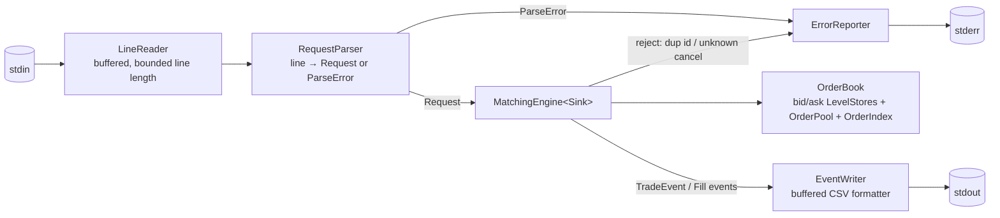

# High-Level Design: Vatic Order Match Assignment

## Problem

Build a single-instrument matching engine that reads a stream of order requests (add / cancel) from stdin, maintains an in-memory limit order book with price-time priority, and writes the resulting trade and fill messages to stdout. No input — malformed, hostile, or merely unusual — may crash the program; every rejected input is reported clearly on stderr.

The deliverable is also a written performance argument: how fast the engine decides whether an add matches, removes filled orders, and removes cancelled orders; which request paths it favors and why; and what would change for production. It is evaluated by a developer at a low-latency futures firm on being clean, readable, efficient, robust, well-structured, and well-tested.

## Approach

### Core mechanism: allocation-free price-time book

- **Price levels per side**: a `std::vector` of levels kept sorted so the **best price is at the back**. The top of book is `back()`; the levels that change most often sit at the end of a contiguous array, where inserting and removing them is cheapest.
- **Orders**: stored in a preallocated, growable **object pool** and addressed by 32-bit index. Each level threads its orders into a **FIFO through links stored in the orders themselves** (an intrusive doubly-linked list), so unlinking any order is O(1) and allocates nothing.
- **Order-id index**: a flat **open-addressing hash table** mapping order id to pool index, which makes cancels O(1).
- **Prices**: **fixed-point `int64`** with 8 decimal places. Comparisons are exact, and output prints the shortest exact form (`1025`, not `1025.00000000`). Negative and zero prices are valid: the brief constrains only quantity to be positive, and futures such as calendar spreads, and WTI crude in April 2020, do trade at or below zero.

### Secondary disciplines

- **Decoupled I/O**: parsing, matching, and output formatting are separate components. The engine never touches streams. It reports events to a sink that is a template parameter, so there is no virtual call on the hot path and tests can capture the events directly.
- **Evidence over assertion**:
  - A deliberately naive *reference engine* in the test suite is compared against the real engine on randomized request streams. A *book-invariant checker* runs after every request, and property tests check conservation laws.
  - A coverage-guided fuzzer with sanitizers enabled attacks the parser and the engine.
  - A benchmark binary reports per-request-type latency percentiles and throughput, and those numbers back the performance write-up.
  - One script, `scripts/check.sh`, runs all of it.

## Target Users

- **Reviewer (primary)**: a Vatic developer reading the code. They need to build it in one command on Linux, understand the structure within minutes, trust that the tests prove correctness, and find the performance reasoning explicit and backed by measurements.
- **Operator (nominal)**: someone who pipes a CSV request stream in and consumes the output messages.

## Goals

1. **Correct.** The engine reproduces the assignment's example output byte-for-byte. It matches the reference engine on randomized streams of at least 10^6 requests with no mismatches.
2. **Robust.** No input crashes the program or corrupts the book. That includes malformed lines, unknown types, out-of-range numbers, duplicate ids, unknown cancel ids, blank lines, CRLF line endings, and very long lines. Each rejected line produces exactly one stderr diagnostic that names the line number and the reason.
3. **Fast on the paths the brief names.**
   - Match check: O(1).
   - Removing a filled order: O(1).
   - Cancel: O(1), plus O(distance from the best price) only when the cancel empties its level.
   - Steady state makes zero heap allocations after warm-up.
4. **Measured.** The benchmark reports p50, p99, and p99.9 latency per request type, plus end-to-end throughput, and `PERFORMANCE.md` cites those numbers.
5. **Readable.** The matching logic reads like the rules in the brief. Every component has one job, and every non-obvious choice has a comment or a Key Design Decisions entry.
6. **Easy to build.** It uses C++20, CMake, and GCC 10+ or Clang 12+ on Linux. There is a single documented build-and-test command, and a Dockerfile that pins a toolchain for reviewers who are not on Linux.
7. **Thoroughly verified.** Every behavior in the brief and every rejection path has a test that cites its EARS ID. Every dataset and generator used for testing ships in the repo, as the brief requires.

## Non-Goals

- Multiple instruments or symbols; there is only one book.
- Order types beyond limit orders: no market, IOC/FOK, stop, or modify/replace requests.
- Self-trade prevention, participant identity, and risk checks.
- Persistence, recovery, and networking.
- Multithreading *inside* the matching path. Matching runs on one thread, which is the industry standard (see FAQ). A pipeline in the style of the LMAX Disruptor (reader/parser → engine → writer over lock-free SPSC rings) is **stretch goal #2**.
- Acknowledgement messages for successful adds or cancels. The brief defines only three output types, and we do not invent more.
- Advanced memory management: a virtual-address reservation with `mmap` so storage grows without moving, hugepages and `mlock`, chunked pools, and incremental rehashing. This is **stretch goal #3**. The baseline preallocates and pre-touches memory at startup and falls back to doubling (`order-book.md` § Memory Lifecycle).
- A dense price ladder (Option B). It is **stretch goal #1**, and the write-up describes it as the production direction for a contract with a known tick size.

## System Design

| Component | Responsibility | Planned LLD |
|---|---|---|
| **Price** | Fixed-point value type: parse from decimal text, compare, format exactly | `docs/llds/price.md` |
| **Protocol** | `LineReader` + `RequestParser`: turn raw bytes into typed `AddOrder`/`CancelOrder` requests or precise parse errors | `docs/llds/protocol.md` |
| **OrderBook** | Storage: `LevelStore` (sorted vector, best at back), `OrderPool` (index-addressed slab + free list), `OrderIndex` (open-addressing id → index), intrusive per-level FIFO | `docs/llds/order-book.md` |
| **MatchingEngine** | Rules: validate the request against book state, match the aggressive order by price-time priority, rest the remainder, handle cancels, and emit events in the order the brief requires | `docs/llds/matching-engine.md` |
| **Output** | `EventWriter`: format events as CSV into a large buffer and flush it to stdout; `ErrorReporter`: send diagnostics to stderr | `docs/llds/output.md` |
| **App** | `main`: connect the pipeline, handle flags, flush on exit | covered by `protocol.md` / `output.md` |
| **Verification** | Unit tests, property tests, a book-invariant checker, golden end-to-end scenarios (expected stdout and stderr), the reference engine with randomized differential tests, a libFuzzer harness, an allocation-counting test, a dataset generator, the benchmark, coverage reporting, and `scripts/check.sh` | `docs/llds/verification.md` |

**Layout**: `include/` + `src/` for the library (everything except `main`), `app/` for the executable, `tests/`, `fuzz/`, `bench/`, `data/` (golden and generated datasets), `tools/` (the dataset generator), and `scripts/` (`check.sh`). The engine is built as a library so the tests and benchmark link exactly the code that ships.

## Key Design Decisions

1. **Sorted vector of levels with the best price at the back (chosen) vs. `std::map` vs. a dense tick ladder.**
   - **`std::map`**: every level is a separate heap node, and walking the tree jumps around memory. It is the textbook default but slow in practice.
   - **Dense ladder**: O(1) everywhere, but it needs a tick size and price band the brief never gives. The brief says orders may arrive at *any* decimal price, so a robust ladder would need a window, a sparse overflow store, and migration between them, which adds a lot of risk.
   - **Sorted vector**: the match check and fill removal are O(1) because they touch only `back()`. Levels near the top, where nearly all activity happens, are cheap to insert and remove, and all levels sit in one contiguous block of memory.
   - Worst case: adding or removing a level deep in the book costs O(L) because of the `memmove`. We accept that trade-off openly and quantify it in the benchmark.
2. **Intrusive FIFO plus index-addressed pool vs. `std::list`/`std::deque` per level.** Links stored in the order give O(1) unlinking from the middle of a level on cancel, with no per-order allocation. Using 32-bit indices instead of pointers keeps each order small (target: one 64-byte cache line or less), and the pool can grow without invalidating the handles stored in the index.
3. **Open-addressing hash (linear probing, power-of-two capacity) vs. `std::unordered_map`.** `unordered_map` allocates a node for every entry and follows a pointer on every lookup, and cancel is the path that depends most on the index. A flat table keeps a lookup to one or two cache lines. Deletion uses backward-shift (no tombstones), so tables with heavy churn do not slow down over time.
4. **Fixed-point `int64` prices with 8 decimal places vs. `double`.**
   - `double` makes price equality inexact, and equality is exactly what determines whether two orders share a level.
   - Fixed-point allows a maximum price of about 9.2 × 10^10, which is far above any real futures price.
   - 8 decimal places cover every real futures tick. The finest common ones are 1/256 = 0.00390625 (Treasuries) and 0.0000005 (JPY FX).
   - Input with more than 8 fractional digits, or with a value outside ±9.2 × 10^10, is rejected with a diagnostic instead of being silently rounded.
   - Zero and negative prices are accepted.
5. **Engine is independent of I/O; the sink is a template parameter constrained by a concept.** The engine emits typed events instead of text, so the core logic can be tested without parsing strings. The template sink avoids virtual dispatch per event, and a C++20 `concept` states the sink's interface in code. The same engine drives production output, test capture, and the benchmark's null sink.
6. **Semantic rejections happen before any change to the book.** A duplicate live order id or a cancel of an unknown id is rejected with a diagnostic and has no side effects. Validation always finishes before matching starts, so a request cannot be half-applied.
7. **Hand-written parser and formatter vs. iostreams/`scanf`/`printf`.** Formatted stream I/O would dominate the engine's cost. The line reader works over a large buffer, integers are parsed with overflow checks, and output is formatted into a buffer that is flushed in bulk.
8. **C++20** (the brief requires C++14 or later). It adds concepts (a self-documenting sink interface with clear errors), `<bit>` (hash-table sizing), `[[likely]]`/`[[unlikely]]` on the hot paths, and `std::span`, in addition to C++17's `optional`, `variant`, and `string_view`.
   - **Not C++23:** `std::expected` would help the parser, but compiler support is less universal, and a build failure on the reviewer's machine is the worst possible outcome.
   - **Not C++14/17:** we would give up concepts and `<bit>` and gain nothing, because GCC 10+ and Clang 12+ have been standard for years.
   - `constexpr`/`consteval` are used where values are genuinely known at compile time: the powers-of-10 table for price scaling, `static_assert`s on type sizes and layout, and protocol constants. They are not a runtime optimization in themselves, so they are not added elsewhere.
10. **Compiler: both GCC and Clang are supported, and measurements choose between them.** Neither compiler reliably generates faster code, and on integer-heavy, branchy code like this, GCC often wins. The build supports both. `PERFORMANCE.md` reports the benchmark matrix for each, and the README recommends the faster one based on those numbers. Clang is still required for the libFuzzer build.
9. **GoogleTest for tests.** Third-party testing frameworks are allowed. CMake uses a system GoogleTest if one is installed and otherwise downloads it with `FetchContent`. The shipped code has no third-party dependencies.

## Success Metrics

- **Correctness:**
  - The golden example matches byte-for-byte.
  - Every golden end-to-end scenario matches its expected stdout *and* stderr.
  - Differential fuzzing against the reference engine finds 0 mismatches across multiple seeds and at least 10^6 requests.
  - The book-invariant checker passes after every request in every randomized run. Invariants: levels strictly sorted; book never crossed at rest; every level is non-empty and its FIFO links are consistent in both directions; the id index and the order pool agree exactly. The full list is in `order-book.md`.
  - Property tests hold: quantity is conserved (added = 2 × traded + resting + cancelled), every trade is at the resting order's price, price-time priority holds, and output is deterministic.
  - Every EARS spec has at least one test that cites it.
- **Robustness:**
  - A hostile-input dataset (garbage, overflow, boundary values, duplicate ids, CRLF, empty and very long lines, NUL bytes) runs with exit code 0, exactly one diagnostic per bad line, and a book that stays consistent.
  - All tests pass under ASan and UBSan.
  - A libFuzzer campaign over parser + engine finds no crash or sanitizer report.
  - **Stress suite** (real binary, GCC and Clang):
    - 10^7-request runs are byte-identical across compilers and repeated runs,
    - a 5×10^6-order book with 10^5 levels drains cleanly,
    - a 3×10^7-request soak shows flat memory,
    - pathological inputs (a 1 GiB line, 10^7 junk lines) stay within bounded memory,
    - output is complete under a slow consumer.
- **Quality:**
  - ≥95% line coverage and ≥90% branch coverage on the library, and 100% of parser error branches.
  - `-Wall -Wextra -Wpedantic -Werror` builds clean on both GCC and Clang, and clang-tidy reports no warnings.
  - `scripts/check.sh` runs the whole matrix (GCC and Clang × Debug, Release and sanitizer builds), tests, a fuzz smoke run, coverage, and benchmarks, and passes both natively on Linux and in Docker.
- **Performance** (every number in `PERFORMANCE.md` comes from a documented benchmark run):
  - An allocation-counting test (global `operator new` replaced) fails if anything allocates after warm-up.
  - p99 latency of a non-matching add and of a cancel stays flat as book size grows from 10^3 to 10^6 resting orders.
  - **Benchmark matrix.** p50, p99, p99.9, and max latency for each scenario:
    - Adds: resting add with no match; add that fully fills one resting order; add that sweeps 1, 10, and 100 levels; add that creates a new level at the best price vs. deep in the book.
    - Cancels: at the best price; deep in the book; in the middle of a level's FIFO; one that empties its level.
    - Parse-only and format-only throughput.
    - End-to-end throughput for the whole binary with input piped in.
    - Every scenario is run at 10^3, 10^4, 10^5, and 10^6 resting orders, and built with both GCC and Clang.
  - Benchmarks are reproducible: fixed seeds, the CPU, compiler, and flags are recorded, and one command reruns them.
- **The project is broken if** any of these happen:
  - an input crashes the program or its sanitizers,
  - output order differs from TradeEvent → aggressive fill → resting fill,
  - a cancel's cost scales with the number of orders at its price level,
  - or the reviewer cannot build and test it from the README in one step.

## FAQ

- **Why not multithreaded?**
  - Matching on one book is inherently sequential: each request's outcome depends on the complete book state after the previous request, and output order must be deterministic.
  - Sharing one book across threads would need locks or atomics. A contended cache-line transfer costs roughly as much as an entire add or cancel here, and likely more.
  - Real exchanges and trading engines run each book on one pinned, busy-polling thread and scale by sharding instruments across cores. `PERFORMANCE.md` describes this.
  - Threads *can* help around the engine: a reader/parser → engine → writer pipeline over lock-free SPSC ring buffers (the LMAX Disruptor pattern). It trades a cross-core hop per message for throughput. This is **stretch goal #2**. We build it only if the benchmark shows parsing is the bottleneck, and we measure it either way.
- **Are order ids unique for the whole stream or only among live orders?** The brief says ids are unique. We reject any id that is currently live in the book. Detecting reuse of an id that has already filled or been cancelled would require remembering every id ever seen, so memory would grow without bound. Phase 4 will confirm this choice.
- **What does a cancel of an already-filled order do?** The id is no longer in the index, so the cancel is rejected as unknown with a diagnostic, and the book is unchanged.

## References

- Assignment brief: `Vatic_Order_match_assignment.docx.pdf` (confidential; not committed to this repo)
- Planned deliverables: `README.md` (build and run instructions), `PERFORMANCE.md` (complexity analysis, benchmark results, trade-offs, production enhancements)
